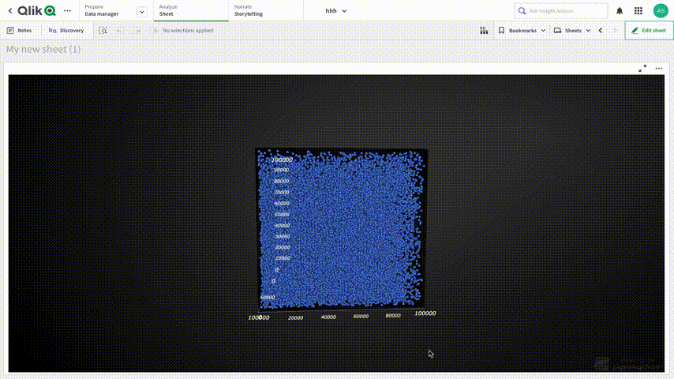
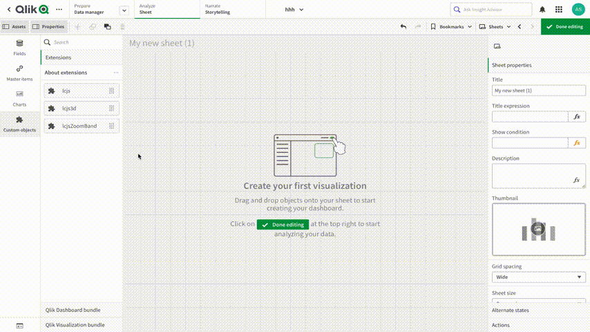

This Qlik extension was made by [lightningChart.js](https://www.arction.com/lightningchart-js/).

# LightningChart JS Qlik 3D Chart

 

## About Extension

 

**This extension was tested with 100k pooints**

 

There is no 3D chart in the default Qlik library, but now you can get it with the lightningChart.js extension

This extension example lets you create 3d chart and style it. You can use our extension as is or refer to our code to improve the extension to suit your needs 

For example, you can create a 3D bar chart, 3D mesh chart, 3D surface, 3D line chart. To see more examples visit [our examples page](https://www.arction.com/lightningchart-js-interactive-examples)

This extension lets you change point size, color, set titles for each Axis and Chart, and change the amount of rendered points.
Here is the process of creating the 3D chart.
 

 

## About LightningChart.js

 

LightningChart JS is a **WebGL-based**, cross-platform charting library that has been developed for delivering the world’s highest performance.

LCJS is the fastest JS chart in the world.  
It shows [700 times better performance](https://www.arction.com/wp-content/uploads/JavaScript%20charts%20performance%20comparison%20-%20line%20charts%20%28May%202021%29.pdf) on high-end desktops than average competitors and 100 times faster than the nearest competitor.
 * Static line charts can visualize up to **[500 millions point](https://www.arction.com/javascript-charts-performance-comparison/)**
 * Real-time line charts can handle over **[10 million data points per second](https://www.arction.com/javascript-charts-performance-comparison/)**

With our library, you can create different types of charts, such as XY, 3D, map, gauge, polar, heatmaps, and [even more](https://www.arction.com/lightningchart-js/) with unmatched performance level

 

## Installation and Usage

 

This extension is **open-source**. You only need to get **LCJS licence**.
To get the licence, please, visit this page https://www.arction.com/lightningchart-js-pricing/

 

**NOTE!**

**Qlik Sense Desktop does not support WebGL**  and there is a significant performance hit. To get the maximum performance, use Qlik Cloud or a browser (http://localhost:4848/hub)

To install, place folder with selected Extension to C:\Users\<User Name>\Documents\Qlik\Sense\Extensions 
or in QlikCloud */qlikcloud.com/console/extensions/ ->  'Add' and upload **extension.zip** folder

To use extension in QlikCloud go to ****/qlikcloud.com/explore/spaces/all and press  'Add new'

 

## Other extensions

* [LightningChart JS Qlik 3D Chart](https://github.com/Arction/lcjs-qlik-chart-3d-extension)
* [LightningChart JS XY Chart](https://github.com/Arction/lcjs-qlik-chart-xy-extension)
